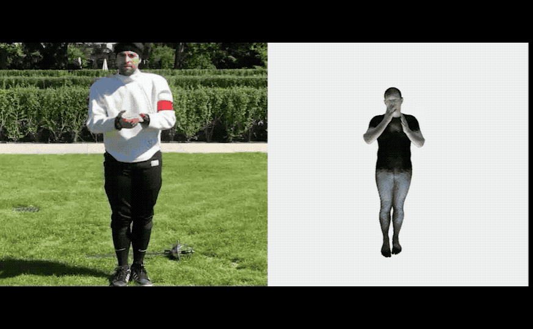

# MEVA: 3D Human Motion Estimation via Motion Compression and Refinement 

[This repo is still under construction]
---

**3D Human Motion Estimation via Motion Compression and Refinement**

**ACCV 2020, Oral**  
[[Project website](https://zhengyiluo.github.io/projects/meva/)][[Quantatitive Demo](https://youtu.be/YBb9NDz3ngM)][[10min Talk](https://youtu.be/-TN3NRpCEc0)]

## Notable

MEVA (Motion Estimation vis Variational Autoencoding) is a video-based 3D human pose estimation method that focus on producing **stable** and **natural-looking** human motion from videos. MEVA achieves state-of-the-art human pose estimation accuracy while reducing acceleration error siginificantly. Pleaser refer to our [paper](https://arxiv.org/abs/2008.03789) for more details.  

## Updates

## Getting Started

## Running inference

## Training 

### Prepare Datasets

## Evaluation

